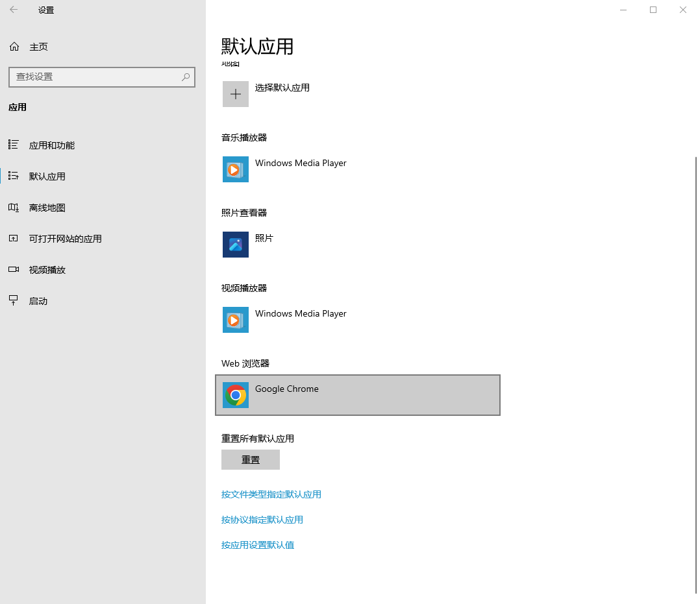
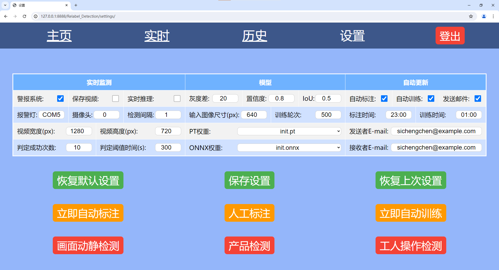
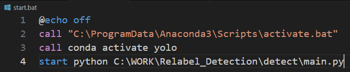

# 1. 项目安装

## 创建虚拟环境
```
conda create -n relabel_detection python=3.11
```

## 安装环境依赖
```
conda activate relabel_detection
cd path/to/the/project
pip install -r requirements.txt
```

要使用GPU，请额外安装下面的环境依赖:
```
pip3 install torch torchvision torchaudio --index-url https://download.pytorch.org/whl/cu121
pip install onnxruntime-gpu
```

## 修改模型权重路径
打开**adds/detection_default.json**

将**pt_weight_path**和**onnx_weight_path**修改为当前路径

点击系统设置界面的**恢复默认设置**按钮来使设置生效

## 修改系统默认浏览器
打开 设置 → 应用 → 默认应用 → Web浏览器

将默认Web浏览器设置为**Google Chrome**



## 安装报警灯驱动并更改报警灯串口
安装**adds/CH341SER.EXE**

在**设置**中修改**报警灯**为报警灯所在端口的COM



## 修改系统启动脚本中的路径
打开**start.bat**

将**第二行**和**第四行**修改为当前路径



## 添加系统启动脚本到自启动
将**start.bat**复制到**C:\ProgramData\Microsoft\Windows\Start Menu\Programs\StartUp**下


# 2. 项目结构树
```
│   #项目根目录
│
│   openh264-1.8.0-win64.dll    # opencv编码h264视频所需文件
│   README.md                   # 工程说明文档
│   requirements.txt            # 环境依赖
│   start.bat                   # 启动脚本
│   System Design_EN.pptx       # 系统架构图英文版
│   System Design_CN.pptx       # 系统架构图中文版
│
├───adds  # 系统文件
│   │   CH341SER.EXE                # 报警灯驱动
│   │   config.json                 # 当前系统使用的配置文件
│   │   config_default.json         # 默认配置文件
│   │   config_last.json            # 上次修改的配置文件
│   │   dataset.yaml                # YOLOv8数据集
│   │   Official Instruction.pdf    # 报警灯使用说明文档
│   │   readme.png                  # 工程说明文档嵌入图
│   │   readme2.png                 # 工程说明文档嵌入图
│   │   readme3.png                 # 工程说明文档嵌入图
│   │   run.json                    # 系统运行文件
│   │
│   └───YoloLabel  # 标注程序
│           ...
│
├───detect  # 检测相关文件
│   │   main.py  # 系统主程序，用于启动其他程序
│   │
│   ├───logs  # 系统生成YOLOv8模型的性能指标
│   │   └───init  # 系统默认YOLOv8模型(init)的性能指标
│   │           ...
│   │
│   ├───utils  # 检测相关逻辑脚本 
│   │      auto_delete.py               # 删除一个月前的图片和视频
│   │      auto_label.py                # 标注新增图像，用于人工勘误
│   │      auto_train.py                # 使用新增勘误后图像训练模型
│   │      buzzer.py                    # 报警灯通信
│   │      manual_label.py              # 启动YoloLabel用于人工勘误
│   │      non_still_detection.py       # 非静止画面检测
│   │      operation_detection.py       # 工人操作检测
│   │      product_model_detection.py   # 产品型号检测
│   │      put_frame.py                 # 摄像头读取和发送
│   │
│   └───weights  # 系统生成YOLOv8模型的权重
│           init.onnx   # 系统默认YOLOv8模型的onnx格式权重，用于推理
│           init.pt     # 系统默认YOLOv8模型的pt格式权重，用于训练
│
├───media  # 存放系统生成的图片和视频
│       labels.txt  # 图像标注类别标签
│   
└───mysite  # Django相关
    │   db.sqlite3          # 系统数据库
    │   manage.py           # Django启动脚本
    │   Settings.url        # 系统设置界面快捷方式
    │   update_database.bat # 修改系统数据库后更新数据库的脚本
    │
    ├───mysite  # Django设置
    │         ...
    │
    └───Relabel_Detection  # 系统前端APP
        │   admin.py    # 管理员
        │   apps.py     # 安装的APP
        │   forms.py    # 表格
        │   models.py   # 模型
        │   urls.py     # URL
        │   views.py    # 视图
        │
        ├───migrations  # 数据库迁移
        │       ...
        │
        ├───static  # CSS和HTML
        │   ├───scripts  # JS
        │   │       history.js  # 历史记录页面JS脚本
        │   │       live.js     # 实时画面页面JS脚本
        │   │       main.js     # 主页面JS脚本
        │   │       settings.js # 系统设置页面JS脚本
        │   │
        │   └───styles  # CSS
        │           history.css   # 历史记录页面CSS样式
        │           live.css      # 实时画面页面CSS样式
        │           login.css     # 用户登录页面CSS样式
        │           main.css      # 主页面CSS样式
        │           settings.css  # 系统设置页面CSS样式
        │
        └───templates  # HTML
                history.html   # 历史记录页面HTML模板
                live.html      # 实时画面页面HTML模板
                login.html     # 用户登录页面HTML模板
                main.html      # 主页面HTML模板
                register.html  # 用户注册页面HTML模板
                settings.html  # 系统设置页面HTML模板
```